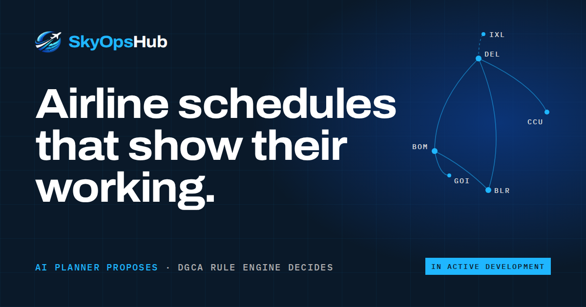

# SkyOpsHub — marketing website



The public website for **SkyOpsHub**, crew and fleet scheduling for Indian carriers. The airline chooses the routes, an AI planner chooses the aircraft and crew, and a deterministic rule engine checks every duty against DGCA flight-duty limits and explains every failure.

**Status:** the product is in active development, and the site says so. The site itself is complete and ready to deploy.

This repo holds the website only. The product lives in two sibling repos: `SkyOpsHub-backend` (FastAPI) and `SkyOpsHub-frontend` (the Flutter operations app).

The site is plain HTML, CSS and JavaScript. There's no framework, no build step and no dependencies. The previous Flutter Web version was retired in September 2026 because Flutter paints the page onto a canvas: search engines and link previews couldn't read it, and visitors downloaded several megabytes before seeing anything. The Flutter source is still in git history, at commit `06f2c21` and earlier.

---

## Run it locally

**Windows:** double-click `start-website.bat`. It starts a local server on <http://localhost:5173> and opens your browser. It uses Python if you have it, otherwise Node (`npx serve`).

**macOS / Linux:**

```sh
./start-website.sh          # or: python3 -m http.server 5173
```

Use a local server rather than opening `index.html` straight from disk. Browsers block web fonts on `file://` pages, so the site would fall back to system fonts.

## Structure

```
index.html                 the whole landing page, one <section> per chapter
form/index.html            standalone early-access page (keeps the old /form link working)
404.html                   "diverted" page for unknown URLs (served automatically by most static hosts)
assets/
  css/main.css             design tokens, layout and every component
  js/core.js               nav, scroll progress, reveal animations, count-ups, pull-quote scrub
  js/hero.js               hero ops console: live route network + streaming job log
  js/demos.js              stepper, shortfall dialogue, roster validator, import review, jobs, roles, status board
  js/form.js               early-access form → Google Apps Script webhook
  fonts/                   Archivo (variable, width + weight) and IBM Plex Mono, self-hosted
  img/                     logo, favicons, social card (og-card.png)
scripts/google_apps_script webhook that receives form submissions
SkyOpsHub-logo-assets/     original brand files
SkyOpsHub-webiste-plan/    planning notes from the Flutter version (historical)
start-website.bat / .sh    local preview on port 5173
site.webmanifest, robots.txt, sitemap.xml
```

## Page map

| # | Section | Anchor | What it shows |
|---|---|---|---|
| — | Hero | `#top` | Headline, CTAs and the live **ops console**: a route network across Indian airports and an illustrative schedule-generation job moving through scope → readiness → chains → solve → validate → persist |
| 01 | Why this exists | `#problem` | The planning problem for Indian carriers after the revised FDTL rules |
| 02 | How it works | `#how` | Six-step auto-advancing walkthrough with a product mock for each step |
| 03 | Guardrails | `#guardrails` | What the agent decides vs what the rules decide; "rejects and explains, never quietly substitutes"; the coverage-shortfall loop |
| 04 | Rulebook | `#rulebook` | The pilot limits the validator uses, plus the interactive **"Be the planner"** roster demo |
| 05 | Master data | `#data` | Import quality review, animated |
| 06 | Durable jobs | `#jobs` | Clickable job history with real failure and partial reasons |
| 07 | Who it's for | `#teams` | Five teams, five questions (light "paper" section) |
| 08 | Under the hood | `#stack` | Architecture diagram and specs |
| 09 | Build log | `#log` | Split-flap status board and a dated changelog |
| 10 | FAQ | `#faq` | Straight answers |
| 11 | Founder | `#founder` | Founder's note |
| 12 | Early access | `#access` | The form |

## Editing content

- **Copy** lives in `index.html`. Each section is marked with a banner comment, for example `<!-- ============ 04 RULEBOOK ============ -->`.
- **Hero job log and network:** the `RUN` array and the `AIRPORTS` / `ROUTES` lists in `assets/js/hero.js`.
- **Roster demo:** `FLIGHTS`, `CREW` and the limits at the top of the roster block in `assets/js/demos.js`. Keep `MIN_REST`, `FDP`, `NIGHT_FDP` and `MAX_NIGHTS` in step with `app/scheduling/regulatory_rules.py` in the backend.
- **Job examples:** the `JOBS` object in `assets/js/demos.js`.
- **Build log:** the status board and timeline in section 09 of `index.html`. Update it when a backend task moves to `documents/tasks/completed/`.
- **Colours:** only the existing SkyOpsHub palette is used, defined once as tokens at the top of `assets/css/main.css` (`--ink #0A1929`, `--panel #132F4C`, `--primary #0B3D91`, `--accent #1FB6FF`, `--paper #FAFAFA`, plus existing supporting blues).

### Content rules

The product docs (`SkyOpsHub-backend/documents/audience details/`) set these, and the site follows them:

- No invented metrics, customers, testimonials or case studies.
- No certification claims (SOC 2, ISO 27001, regulator approval) until they're actually achieved.
- Routes are user-chosen. Never imply the system picks routes.
- The agent owns resource scope. Deterministic code owns legality, and it **rejects and explains**, never substitutes.
- Present maturity as it is: "in active development". The build log should match the backend's task docs.
- Examples (tails like `VT-SKB`, crew names, job IDs) are fictional and are labelled as illustrative.

### Where the facts come from

Check any change against these sources before publishing it:

| Claim on the site | Source |
|---|---|
| Rulebook numbers (12 h rest, 2 nights, 10 h / 2 landings at night, 35 h / 60 h in 7 days, 1,000 h / 1,800 h in 365 days, 48 h / 60 h weekly rest) | `SkyOpsHub-backend/app/scheduling/regulatory_rules.py`. These match DGCA CAR Section 7, Series J, Part III, Revision 1 (8 January 2024) for pilots and Part I for cabin crew |
| "Blocks" vs "Flags a warning" on each limit | `app/scheduling/validation.py`, `_validate_crew_regulatory_profile`. Weekly rest only produces a warning |
| January 2024 FDTL changes (weekly rest 36→48 h, night 00:00–05:00 → 00:00–06:00, night landings 6→2) | DGCA revision of 8 January 2024 |
| Licence and medical checked against the duty date | `validation.py`, credential check (commit of 21 Sep 2026) |
| "B737" is ambiguous; catalog names like "Boeing 737 MAX 8" | `tests/services/test_aircraft_taxonomy_normalizer.py` and `documents/compliance docs/commercial_jets_catalog_airline_admin.xlsx` |
| Cancel revokes the worker task | `app/jobs/schedule_jobs.py`, `cancel_schedule_job` |
| Disruption handling (replace or delay) | `app/services/schedule_service.py`, `apply_schedule_disruption` |
| Export formats (PDF, Excel, iCal) | `app/api/v1/routers/schedules.py` |
| Build log dates | Git history of the backend and frontend repos |

## Before you publish a change

- [ ] Run it locally and click through every section.
- [ ] Check a narrow phone (320 px), a tablet (768 px) and a desktop width in your browser's device toolbar. The page must never scroll sideways.
- [ ] Try the interactive pieces: the stepper, the "Be the planner" roster (including "Let the planner try"), the job rows, the team tabs and the FAQ.
- [ ] Submit the form once with an empty field to see the validation messages.
- [ ] Check every new or changed claim against the table above, or add its source to the table.
- [ ] If a backend rule changed, update the rulebook tiles, the roster limits in `demos.js`, the FAQ and the build log together.

## Early-access form

`assets/js/form.js` posts `name`, `workEmail`, `companyName` and `message` (with the selected team prefixed) to the Apps Script web app in `scripts/google_apps_script/`. The script saves each request to Drive and emails a notification.

To redeploy the script, follow `scripts/google_apps_script/README.md`, then paste the new URL into the `WEBHOOK` constant at the top of `form.js`. A hidden honeypot field drops simple bots. If the request fails, the form shows the fallback address, admin@skyopshub.in.

## Deploying

Upload the repo contents to any static host: Cloudflare Pages, Netlify, GitHub Pages, S3 + CloudFront or plain nginx. No build command, and the output directory is the repo root. Point unknown routes at `404.html` if your host doesn't do that automatically.

## Screen sizes and browsers

- An automated check found no sideways scrolling or clipped text at 23 viewports from 320 px to 2560 px, on the home page, `/form/` and `404.html`. That includes phones held sideways (844×390 and 932×430).
- Phones get dedicated layouts:
  - The roster demo becomes one row per flight, with the captain's name on each button.
  - The import table stacks the name above the aircraft type.
  - The rulebook tiles go to one column.
  - The team tabs scroll sideways.
  - The architecture diagram becomes a vertical stack.
- Above 1800 px the type and content width scale up, so large monitors don't show a small island of content.
- Built with standard CSS (grid, custom properties) for current evergreen browsers. The automated checks ran in Chromium.

## Accessibility and performance

- Semantic landmarks, a skip link, keyboard-operable tabs (arrow keys, Home, End) and a visible focus ring.
- Everything animated respects `prefers-reduced-motion`: all content is visible at rest and the demos show their finished state. Animations pause when off-screen.
- Around 120 KB of self-hosted fonts, no third-party requests on page load (only the form talks to Google Apps Script), and no JavaScript frameworks.

## Fonts

Archivo and IBM Plex Mono are both licensed under the SIL Open Font License 1.1 and are self-hosted in `assets/fonts/`.
