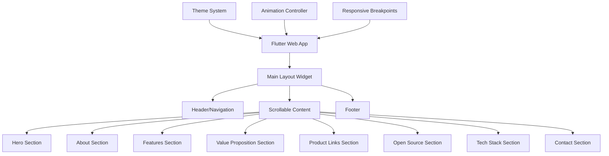

# Design Document: SkyOpsHub Marketing Website

## Overview

The SkyOpsHub marketing website is a modern, professional, responsive web application built with Flutter Web. It serves as the primary digital presence for an AI-powered airline operations management platform, targeting enterprise customers including airline decision-makers, engineers, and product managers. The website emphasizes credibility, innovation, and trustworthiness while providing clear pathways to product access and engagement.

The design follows a single-page application (SPA) architecture with smooth scrolling between sections, implementing Material Design 3 principles with a custom aviation-inspired theme. The website prioritizes performance, accessibility, and responsive design to ensure optimal user experience across all devices.

## Architecture

### High-Level Architecture



### Application Structure

The application follows a modular widget-based architecture:

- **Main App**: Entry point with theme configuration and routing
- **Layout System**: Responsive layout management with breakpoint handling
- **Section Widgets**: Reusable components for each website section
- **Theme System**: Centralized styling with aviation-inspired color palette
- **Animation System**: Smooth scroll and transition animations
- **Asset Management**: Optimized images, icons, and fonts

### Responsive Design Strategy

The website implements a mobile-first responsive design with three primary breakpoints:

- **Mobile**: < 768px (single column, stacked layout)
- **Tablet**: 768px - 1024px (two-column hybrid layout)
- **Desktop**: > 1024px (multi-column, full-width layout)

## Components and Interfaces

### Core Widget Hierarchy

```dart
// Pseudocode structure
class SkyOpsHubWebsite extends StatelessWidget {
  Widget build(BuildContext context) {
    return MaterialApp(
      theme: SkyOpsTheme.lightTheme,
      home: MainLayout(),
    );
  }
}

class MainLayout extends StatefulWidget {
  Widget build(BuildContext context) {
    return Scaffold(
      body: CustomScrollView(
        slivers: [
          SliverAppBar(), // Navigation
          SliverList(
            delegate: SliverChildListDelegate([
              HeroSection(),
              AboutSection(),
              FeaturesSection(),
              ValuePropositionSection(),
              ProductLinksSection(),
              OpenSourceSection(),
              TechStackSection(),
              ContactSection(),
            ]),
          ),
        ],
      ),
    );
  }
}
```

### Section Components

#### 1. Hero Section Component
```dart
class HeroSection extends StatelessWidget {
  // Contains:
  // - Animated product name and tagline
  // - Gradient background with subtle animations
  // - Primary and secondary CTAs
  // - Responsive text sizing
}
```

#### 2. Features Section Component
```dart
class FeaturesSection extends StatelessWidget {
  // Contains:
  // - Grid layout of feature cards
  // - Icon + title + description format
  // - Hover animations
  // - Responsive grid (1-2-3 columns based on screen size)
}

class FeatureCard extends StatelessWidget {
  final IconData icon;
  final String title;
  final String description;
  // Reusable card component with consistent styling
}
```

#### 3. Navigation Component
```dart
class ResponsiveNavigation extends StatelessWidget {
  // Contains:
  // - Desktop: Horizontal navigation bar
  // - Mobile: Hamburger menu with drawer
  // - Smooth scroll to sections
  // - Active section highlighting
}
```

### Theme System

```dart
class SkyOpsTheme {
  static ThemeData get lightTheme {
    return ThemeData(
      colorScheme: ColorScheme.fromSeed(
        seedColor: Color(0xFF1565C0), // Aviation blue
        brightness: Brightness.light,
      ),
      // Custom color palette
      primaryColor: Color(0xFF1565C0), // Deep blue
      backgroundColor: Color(0xFFFAFAFA), // Off-white
      surfaceColor: Colors.white,
      // Typography
      textTheme: GoogleFonts.interTextTheme(),
      // Component themes
    );
  }
}
```

### Animation System

```dart
class ScrollAnimationController {
  // Manages:
  // - Fade-in animations for sections
  // - Parallax effects for hero section
  // - Smooth scroll behavior
  // - Intersection observer for triggering animations
}
```

## Data Models

### Content Models

```dart
class FeatureData {
  final String title;
  final String description;
  final IconData icon;
  final String? linkUrl;
  
  const FeatureData({
    required this.title,
    required this.description,
    required this.icon,
    this.linkUrl,
  });
}

class SocialLink {
  final String platform;
  final String url;
  final IconData icon;
  
  const SocialLink({
    required this.platform,
    required this.url,
    required this.icon,
  });
}

class TechStackItem {
  final String name;
  final String description;
  final String? logoPath;
  
  const TechStackItem({
    required this.name,
    required this.description,
    this.logoPath,
  });
}
```

### Configuration Models

```dart
class WebsiteConfig {
  static const String productName = "SkyOpsHub";
  static const String tagline = "AI-Driven Intelligence for Smarter Airline Operations";
  static const String contactEmail = "contact@skyopshub.in";
  static const String productAppUrl = "https://app.skyopshub.in";
  static const String githubUrl = "https://github.com/skyopshub";
  
  static const List<FeatureData> features = [
    FeatureData(
      title: "AI-Powered Scheduling Optimization",
      description: "Advanced algorithms optimize flight schedules and resource allocation",
      icon: Icons.schedule,
    ),
    // ... other features
  ];
}
```

### Responsive Breakpoint System

```dart
class ResponsiveBreakpoints {
  static const double mobile = 768;
  static const double tablet = 1024;
  static const double desktop = 1440;
  
  static bool isMobile(BuildContext context) {
    return MediaQuery.of(context).size.width < mobile;
  }
  
  static bool isTablet(BuildContext context) {
    final width = MediaQuery.of(context).size.width;
    return width >= mobile && width < tablet;
  }
  
  static bool isDesktop(BuildContext context) {
    return MediaQuery.of(context).size.width >= tablet;
  }
}
```

## Correctness Properties

*A property is a characteristic or behavior that should hold true across all valid executions of a system—essentially, a formal statement about what the system should do. Properties serve as the bridge between human-readable specifications and machine-verifiable correctness guarantees.*

Based on the requirements analysis, the following correctness properties ensure the website functions correctly across all scenarios:

### Property 1: Responsive Layout Adaptation
*For any* screen width, the website should adapt its layout appropriately: mobile layout for widths < 768px, tablet layout for 768px-1024px, and desktop layout for widths > 1024px, with all interactive elements remaining accessible
**Validates: Requirements 2.1, 2.2, 2.3, 2.5**

### Property 2: Feature Card Rendering Consistency  
*For any* list of feature data, the features section should render exactly the same number of feature cards as input features, with each card containing an icon, title, and description
**Validates: Requirements 1.3**

### Property 3: Theme Consistency Across Components
*For any* widget in the application, it should use colors and typography from the centralized theme system, ensuring visual consistency throughout all sections
**Validates: Requirements 3.5, 7.4**

### Property 4: Animation Performance and Smoothness
*For any* user interaction (scroll, hover, transition), the website should maintain smooth animations without performance degradation and complete animations within reasonable time bounds
**Validates: Requirements 5.1, 5.2, 5.3, 5.4, 5.5**

### Property 5: Content Compliance Validation
*For any* text content displayed on the website, it should not contain job-seeking terms, personal goals, or other non-enterprise content as defined in the prohibited content list
**Validates: Requirements 10.3**

## Error Handling

### Network and Asset Loading
- **Image Loading Failures**: Display placeholder images or graceful fallbacks when assets fail to load
- **Font Loading Issues**: Provide system font fallbacks to ensure text remains readable
- **Animation Performance**: Reduce or disable animations on lower-performance devices

### Responsive Design Edge Cases
- **Ultra-wide Screens**: Implement maximum width constraints to prevent content stretching
- **Very Small Screens**: Ensure minimum touch target sizes and readable text
- **Orientation Changes**: Handle device rotation smoothly without layout breaks

### User Interaction Errors
- **Broken External Links**: Validate external URLs and provide user feedback for broken links
- **Touch/Click Failures**: Implement proper error states for failed interactions
- **Scroll Position Issues**: Maintain scroll position during dynamic content updates

### Browser Compatibility
- **Unsupported Features**: Provide fallbacks for browsers that don't support certain CSS or Flutter Web features
- **Performance Degradation**: Implement progressive enhancement for older browsers
- **JavaScript Disabled**: Ensure basic content accessibility even without JavaScript

## Testing Strategy

### Dual Testing Approach

The testing strategy employs both unit testing and property-based testing to ensure comprehensive coverage:

**Unit Tests** focus on:
- Specific widget rendering with known inputs
- Individual component behavior verification
- Edge cases and error conditions
- Integration points between components

**Property-Based Tests** focus on:
- Universal properties that hold across all inputs
- Responsive behavior across different screen sizes
- Theme consistency across all components
- Animation performance under various conditions

### Property-Based Testing Configuration

- **Framework**: Use the `test` package with custom property generators for Flutter widgets
- **Iterations**: Minimum 100 iterations per property test to ensure thorough coverage
- **Test Tagging**: Each property test must reference its design document property using the format:
  - **Feature: skyopshub-marketing-website, Property 1: Responsive Layout Adaptation**
  - **Feature: skyopshub-marketing-website, Property 2: Feature Card Rendering Consistency**
  - **Feature: skyopshub-marketing-website, Property 3: Theme Consistency Across Components**
  - **Feature: skyopshub-marketing-website, Property 4: Animation Performance and Smoothness**
  - **Feature: skyopshub-marketing-website, Property 5: Content Compliance Validation**

### Unit Testing Focus Areas

**Widget Testing**:
- Hero section renders with correct tagline and CTAs
- Navigation component displays all required sections
- Footer contains copyright and navigation links
- Contact section includes all social media links

**Integration Testing**:
- Scroll navigation between sections works correctly
- External links open in new tabs/windows
- Theme application across nested widget trees
- Responsive breakpoint transitions

**Performance Testing**:
- Initial page load time under 3 seconds
- Smooth 60fps animations during interactions
- Memory usage remains stable during extended use
- Bundle size optimization for web deployment

### Test Data Management

**Static Content Testing**:
- Verify all required text content is present and correctly formatted
- Validate that exactly six features are displayed with proper structure
- Ensure all external URLs are properly formatted and accessible

**Dynamic Behavior Testing**:
- Test responsive layout changes across multiple screen sizes
- Verify animation triggers and completion states
- Validate theme consistency across dynamically generated content

The testing strategy ensures both specific functionality (unit tests) and universal correctness (property tests) while maintaining fast feedback loops during development.